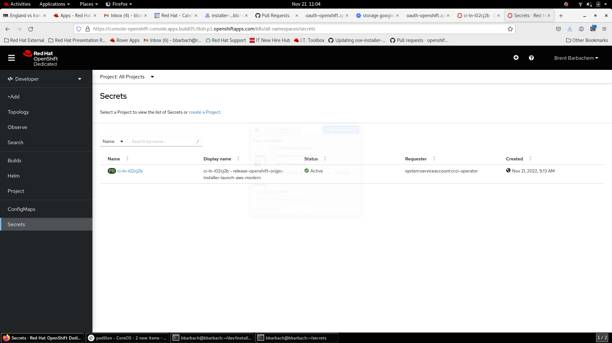

# Custom Openshift Build Images from Cluster Bot

The document is put together in order to describe how to use a custom image built from Openshift Cluster bot to test against. Use the following link to get to all of the [registry pages](https://docs.ci.openshift.org/docs/getting-started/useful-links/#clusters). For a complete list of all [useful link ...](https://docs.ci.openshift.org/docs/getting-started/useful-links/#clusters)


## Creating the Cluster Bot Image

**Note**: _The Cluster Bot has many other uses than the one described here._

The Cluster Bot can be used to build an image from a Pull Request. The following is an example:

```bash
build openshift/{Project}#{Pull Request Number}
```

The `#` sign is required in the above sample.

The Cluster Bot will provide a link to the cluster (if succeeded). Follow the link to the prow site. Examine the build log text, and look for the image that was created. A line similar to the following should appear:

```bash
 Creating release image registry.build05.ci.openshift.org/ci-ln-i02cj2b/release:latest
```

The build image cannot be pulled since the permissions have (probably) not been added to the CI pull secret.


## Add the Pull Secret

Visit the [link](https://docs.ci.openshift.org/docs/getting-started/useful-links/#clusters) at the top of this page. Click on the registry on the page. Following the example above, `build05` would be selected where you would be taken to a page similar to the image below. If you cannot find the link at the top of the listed page, please visit [this page](https://console-openshift-console.apps.build05.l9oh.p1.openshiftapps.com/k8s/all-namespaces/secrets) directly.

<h1 align="center">
    
</h1>

In the top right corner, under your name, click `Copy login command`. You will be taken to a page to get your token. Similar to the secrets page, add this secret to your secrets.


## Pull the image

```bash
podman pull <image>:<tag>
```

Following the example above, you would use

```bash
podman pull registry.build05.ci.openshift.org/ci-ln-i02cj2b/release:latest
```

Now you should be able to pull/download the image successfully.


## Using the image

The purpose of this document was to use the build image during an openshift-install manual build. Now that we have an image, its time to use it. To override the image we set the environment variable:

```bash
export OPENSHIFT_INSTALL_RELEASE_IMAGE_OVERRIDE={image}:{tag}
```

turns into the following when using the example above:

```bash
export OPENSHIFT_INSTALL_RELEASE_IMAGE_OVERRIDE=registry.build05.ci.openshift.org/ci-ln-i02cj2b/release:latest
```
